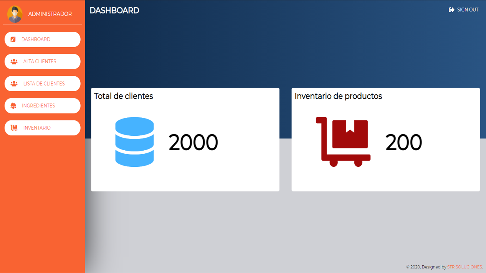

## Datos del diseñador

- Tema: Gestor Administrativo
- STR SOLUCIONES
- Ing. Desarrollo de Software

## Instalacion

- Agregue el archivo a su carpeta htdocs
- Cree una base de datos llamada pizzeria
- Importe la base datos que viene en el repositorio (la base de datos se llama pizzeria.sql)
- Levante su servidor y base de datos
- introduzca el usuario: ADMINISTRADOR
- introuduzca la contraseña: STRSOLUCIONES
